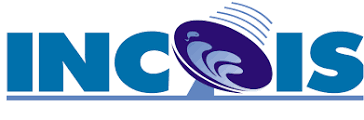

## Thank you for inspiration and content!

Thank you to the open science community that has created software, teaching resources, and workflows that we have been able to build off of and be inspired by. These include: 
[NASA Openscapes](https://nasa-openscapes.github.io) &bullet; 
[OceanHackWeek](https://oceanhackweek.org) &bullet; 
[SnowEx Hackweek](https://snowex.hackweek.io/) &bullet; 
[eScience Institute, University of Washington](https://guidebook.hackweek.io/intro.html) &bullet; 
[ICESat-2 Hackweek](https://icesat-2-2022.hackweek.io/) &bullet;
[Project Jupyter](https://jupyter.org/) &bullet; 
[Pangeo Project](https://pangeo.io/) &bullet; 
[CryoCloud](https://cryointhecloud.com/)
  
 Thanks to [OceanHackWeek](https://oceanhackweek.org/) for content, inspiration, and the opportunity to test out ideas. A big thanks to the SDM team at OceanHackWeek 2023 who helped test and develop SDM tutorials for the ITCOocean Hack2week 2023: Catherine Courtier, [Mackenzie Fiss](https://github.com/mackenziefiss), [Denisse Fierro Arcos](https://github.com/lidefi87), [Paulo Freire](https://github.com/Pfreire29), Jade Hong, Caitlin O’Brien, Mary Solokas, Laura Tsang, [Tylar Murray](https://github.com/7yl4r), [Ben Tupper](https://github.com/btupper)! [OHW23 SDM team project](https://oceanhackweek.org/ohw23_proj_marinesdms/).

## Thank you for support!

Thank you! INCOIS and ITCOocean provided all the logistical support and supported Nimit Kumar, TVS Uday Bhaskar and Swarnali Majumder's participation. CMLRE supported Smitha BR's participation and IITM supported Aditi Modi. A NOAA International Fellowship supported Eli Holmes' visit. [2i2c](https://2i2c.org/) provided the JupyterHub infrastructure. [ESIPfed](https://www.esipfed.org/) provided funding for the JupyterHub via their ESIP Lab fund. Undergraduate summer interns, Minh Phan and Jiarui Yu, were supported by the [Usha and S. Rao Varanasi](https://www.aa.washington.edu/giving/varanasis) endowment for Math-Fish student support at the University of Washington (Seattle, WA).

{height=100px}
{height=100px}
{height=150px}
{height=150px}
 
[{height=100px}](https://2i2c.org)
[{height=100px}](https://www.esipfed.org)

