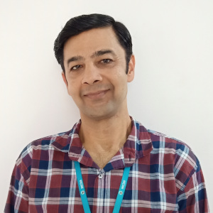

## Instructors

### Dr. Eli Holmes

{width=75% fig-alt="picture of Eli Holmes"}

[NOAA Fisheries](https://www.fisheries.noaa.gov/) and [University of Washington](https://fish.uw.edu/), USA.

**Links:** [webpage](https://eeholmes.github.io/) &#x2022;  [GitHub](https://github.com/eeholmes)

### Dr. Nimit Kumar

{width=75% fig-alt="picture of Nimit Kumar"}

[INCOIS](https://incois.gov.in/)

**Links:** [OceanExpert page](https://oceanexpert.org/expert/Nimit)

### Dr. TVS Uday Bhaskar

{width=75% fig-alt="picture of Uday Bhaskar"}

[INCOIS](https://incois.gov.in/)

**Links:** [ResearchGate page](https://www.researchgate.net/profile/Tvs-Udaya-Bhaskar)

## Support

### Jiarui Yu

{width=75% fig-alt="picture of UW"}

Machine-learning tutorials; rising senior University of Washington, Applied & Computational Mathematical Sciences (ACMS), 2023 UW Varanasi Intern

**Links:** [GitHub](https://github.com/NaNa7Miiii) &#x2022;  [Linkedin](https://www.linkedin.com/in/jiarui-yu-0b0ab522b/)

### Minh Phan

{width=75% fig-alt="Minh Phan"}

Indian Ocean database for hackweek, data access tutorials. rising senior University of Washington, Applied & Computational Mathematical Sciences (ACMS), 2023 UW Varanasi Intern

**Links:** [GitHub](https://github.com/minhphan03) &#x2022;  [Linkedin](https://www.linkedin.com/in/minhphan0612/)

