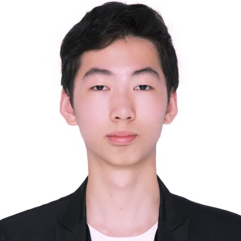

## Instructors

### Dr. Eli Holmes

<!--
 {width=75% fig-alt="picture of Eli Holmes"}
-->

[NOAA Fisheries](https://www.fisheries.noaa.gov/) and [University of Washington](https://fish.uw.edu/), USA.

**Links:** [webpage](https://eeholmes.github.io/) &#x2022;  [GitHub](https://github.com/eeholmes)  &#x2022; [ORCID](https://orcid.org/0000-0001-9128-8393)

### Dr. Nimit Kumar

<!--
{width=75% fig-alt="picture of Nimit Kumar"}
-->

Indian National Centre for Ocean Information Services ([INCOIS](https://incois.gov.in/)), Hyderabad, India

**Links:** [webpage](https://oceanexpert.org/expert/Nimit)  &#x2022; [ORCID](https://orcid.org/0000-0002-3815-5919)

### Dr. TVS Uday Bhaskar

<!--
{width=75% fig-alt="Uday Bhaskar"}
-->

Indian National Centre for Ocean Information Services ([INCOIS](https://incois.gov.in/)), Hyderabad, India

**Links:** [ResearchGate](https://www.researchgate.net/profile/Tvs-Udaya-Bhaskar)   &#x2022; [ORCID](https://orcid.org/0000-0001-6438-5016)

### Aditi Modi

Centre for Climate Change Research, Indian Institute of Tropical Meteorology ([CCCR](http://cccr.tropmet.res.in/home/index.jsp)), Pune, India

**Links:** [webpage](https://aditimodi.github.io/)  &#x2022; [GitHub](https://github.com/aditimodi)  &#x2022; [ORCID](https://orcid.org/0000-0002-2044-5256)

### Dr. Smitha BR

Centre for Marine Living Resources & Ecology ([CMLRE](https://www.cmlre.gov.in/)), Kochi, India

**Links:** [webpage](https://www.researchgate.net/profile/Smitha-Br)  &#x2022; [ORCID](https://orcid.org/0000-0003-3470-9272)

### Dr. Swarnali Majumder

Indian National Centre for Ocean Information Services ([INCOIS](https://incois.gov.in/)), Hyderabad, India

**Links:** [webpage](https://www.researchgate.net/profile/Swarnali-Majumder)  &#x2022; [ORCID](https://orcid.org/0000-0001-9917-4454)

## Support

### Jiarui Yu

<!--
{width=75% fig-alt="Jiarui Yu"}
-->

Machine-learning tutorials; rising senior Applied & Computational Mathematical Sciences (ACMS), University of Washington (UW), Seattle WA, USA; 2023 UW Varanasi Intern

**Links:** [GitHub](https://github.com/NaNa7Miiii) &#x2022;  [Linkedin](https://www.linkedin.com/in/jiarui-yu-0b0ab522b/)

### Minh Phan

<!--
{width=75% fig-alt="Minh Phan"}
-->

Indian Ocean database for hackweek, data access tutorials. rising senior Applied & Computational Mathematical Sciences (ACMS), University of Washington (UW), Seattle WA, USA; 2023 UW Varanasi Intern

**Links:** [GitHub](https://github.com/minhphan03) &#x2022;  [Linkedin](https://www.linkedin.com/in/minhphan0612/)

