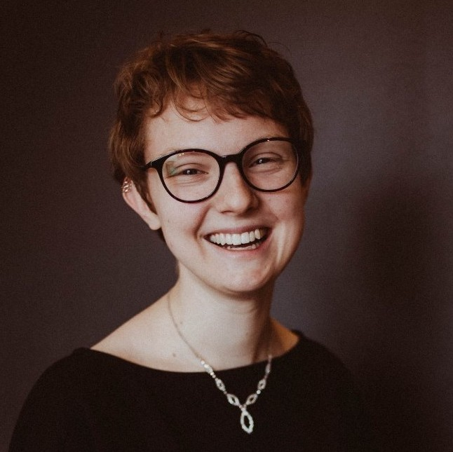
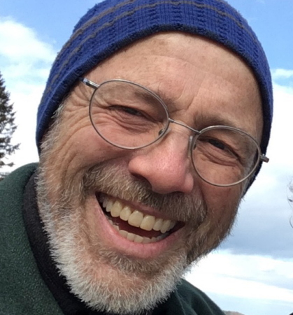
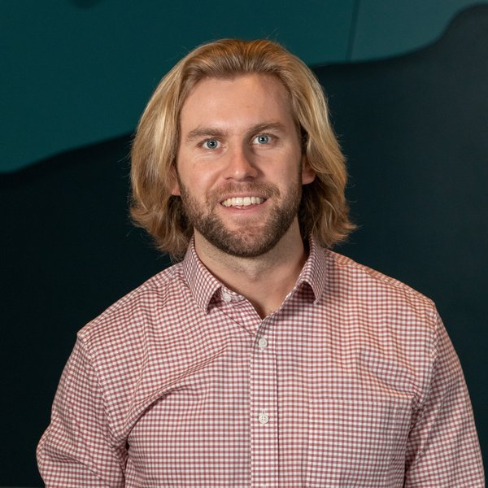
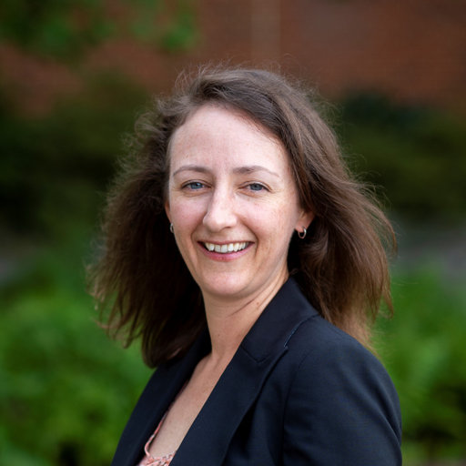

## Organizers and Instructors

### Dr. Eli Holmes

<!--
 {width=75% fig-alt="picture of Eli Holmes"}
-->

[NOAA Fisheries](https://www.fisheries.noaa.gov/) and [University of Washington](https://fish.uw.edu/), Seattle, USA.

[webpage](https://eeholmes.github.io/) &#x2022;  [GitHub](https://github.com/eeholmes)  &#x2022; [ORCID](https://orcid.org/0000-0001-9128-8393)

### Dr. Nimit Kumar

<!--
{width=75% fig-alt="picture of Nimit Kumar"}
-->

Indian National Centre for Ocean Information Services ([INCOIS](https://incois.gov.in/)), Hyderabad, India

**Links:** [webpage](https://oceanexpert.org/expert/Nimit)  &#x2022; [ORCID](https://orcid.org/0000-0002-3815-5919)

### Aditi Modi

[Centre for Climate Change Research](http://cccr.tropmet.res.in/home/index.jsp), Indian Institute of Tropical Meteorology, Pune, India

[webpage](https://aditimodi.github.io/)  &#x2022; [GitHub](https://github.com/aditimodi)  &#x2022; [ORCID](https://orcid.org/0000-0002-2044-5256)

### Dr. Smitha BR

[Centre for Marine Living Resources & Ecology](https://www.cmlre.gov.in/), Kochi, India

[webpage](https://www.researchgate.net/profile/Smitha-Br)  &#x2022; [ORCID](https://orcid.org/0000-0003-3470-9272)

### Dr. Swarnali Majumder

[Indian National Centre for Ocean Information Services](https://incois.gov.in/), Hyderabad, India

[webpage](https://www.researchgate.net/profile/Swarnali-Majumder)  &#x2022; [ORCID](https://orcid.org/0000-0001-9917-4454)

### Dr. TVS Uday Bhaskar

[Indian National Centre for Ocean Information Services](https://incois.gov.in/), Hyderabad, India

[ResearchGate](https://www.researchgate.net/profile/Tvs-Udaya-Bhaskar)   &#x2022; [ORCID](https://orcid.org/0000-0001-6438-5016)

### Dr. Sourav Maity

[Indian National Centre for Ocean Information Services](https://incois.gov.in/), Hyderabad, India

[ResearchGate](https://www.researchgate.net/profile/Sourav-Maity-2)   &#x2022; [ORCID](https://orcid.org/0000-0003-2337-5457)

## Speakers

### Johnny Konjarla

[Centre for Marine Living Resources & Ecology](https://www.cmlre.gov.in/), Kochi, India

[webpage](https://oceanexpert.org/expert/33322) &#x2022;  [Linkedin](https://www.linkedin.com/in/johnny-konjarla-59b37152/) &#x2022; [ORCID](https://orcid.org/0000-0003-3181-0498)

### Myranda Shirk

Senior Data Scientist, Vanderbilt University Data Science Institute

[Linkedin](https://www.linkedin.com/in/myranda-uselton-shirk/)  

### Dr. Ben Best

[EcoQuants.com](https://ecoquants.com/), Santa Barbara, CA

[webpage](https://bbest.github.io/about.html) &#x2022;  [GitHub](https://github.com/bbest) &#x2022; [ORCID](https://orcid.org/0000-0002-2686-0784)

### Minh Phan

Applied & Computational Mathematical Sciences, University of Washington, Seattle WA, USA

[GitHub](https://github.com/minhphan03) &#x2022;  [Linkedin](https://www.linkedin.com/in/minhphan0612/)

### Dr. Sanitha K. Sivadas

[National Centre for Coastal Research](https://www.nccr.gov.in), Chennai, India

[Ocean Expert](https://oceanexpert.org/expert/27490) &#x2022;  [ORCID](https://orcid.org/0000-0002-9243-1347)

### Jiarui Yu

Applied & Computational Mathematical Sciences, University of Washington, Seattle WA, USA

[GitHub](https://github.com/NaNa7Miiii) &#x2022;  [Linkedin](https://www.linkedin.com/in/jiarui-yu-0b0ab522b/)

## Virtual Helpers

### Ben Tupper

Tandy Center for Ocean Forecasting, [Bigelow Laboratory](https://www.bigelow.org/) for Ocean Sciences, East Boothbay, Maine, USA.

[ResearchGate](https://www.researchgate.net/scientific-contributions/Benjamin-Tupper-2144022653)

### Dr. Julie Lowndes

Openscapes, Santa Barbara, California, USA

[Website](https://jules32.github.io/) &#x2022;  [ORCID](https://orcid.org/0000-0003-1682-3872)

### Adam Kemberling

[Gulf of Maine Research Institute](https://gmri.org/), Portland, Maine, USA.

[Website](https://gmri.org/our-approach/staff/adam-kemberling/)

### Dr. Rachael Blake

Director of Data Science, [Intertidal Agency](https://intertidal.agency/), USA.

[Website](https://www.rachaeleblake.com/) &#x2022;  [ORCID](https://orcid.org/0000-0003-0847-9100)

### Suman Shekhar

Rutgers University, New Brunswick, NJ, USA.

[Website](https://marine.rutgers.edu/team/suman-shekhar/) &#x2022;  [GitHub](https://github.com/Sumanshekhar17)

### Seungyeon Jade Hong

[GitHub](https://github.com/Sumanshekhar17)

